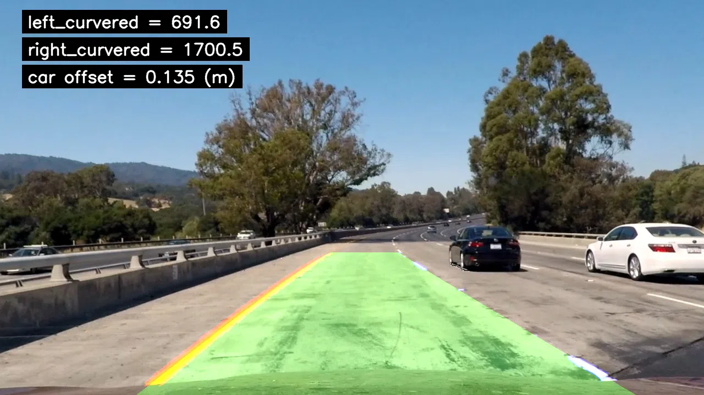

## Advanced Lane Finding

In this project, your goal is to write a software pipeline to identify the lane boundaries in a video, but the main output or product we want you to create is a detailed writeup of the project.

### The Project

The goals / steps of this project are the following:

1. Compute the camera calibration matrix and distortion coefficients given a set of chessboard images. [LINK](docs/Calibration.md)
2. Apply a distortion correction to raw images. [LINK](docs/Calibration.md)
3. Use color transforms, gradients, etc., to create a thresholded binary image. [LINK](docs/BinaryThresholding.md)
4. Apply a perspective transform to rectify binary image ("birds-eye view"). [LINK](docs/PerspectiveTransform.md)
5. Detect lane pixels and fit to find the lane boundary.
6. Determine the curvature of the lane and vehicle position with respect to center.
7. Warp the detected lane boundaries back onto the original image.
8. Output visual display of the lane boundaries and numerical estimation of lane curvature and vehicle position.

### Requirements

