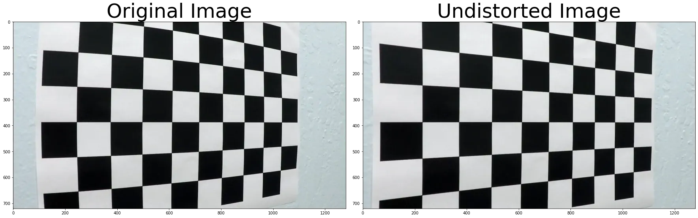
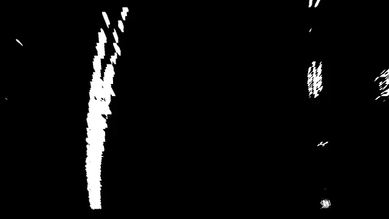
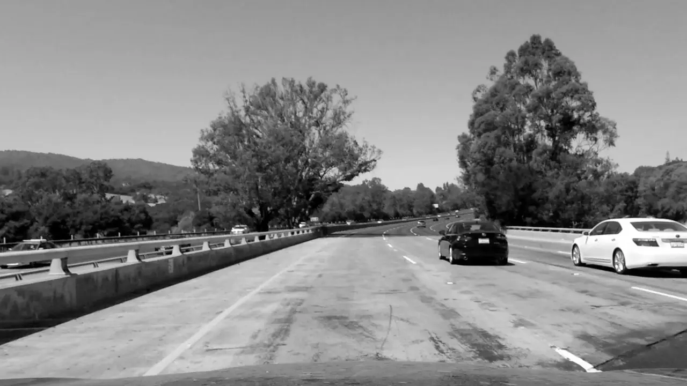
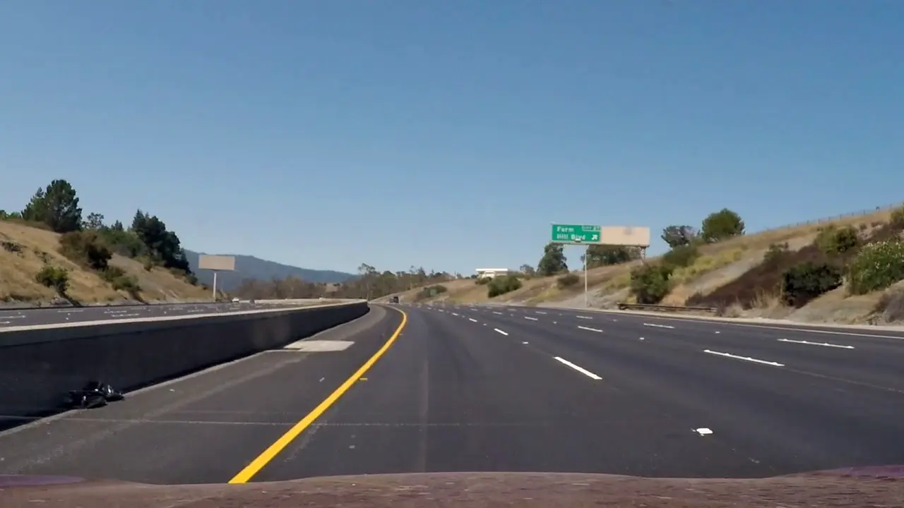

## Advanced Lane Finding

[](http://www.udacity.com/drive)

### Contents

1. [Introdution](#introdution)
2. [Data Samples](#data-samples)
3. [Requirements](#requirements)
4. [Algorithm](#algorithm)
5. [Result](#result)
6. [Challenges](#challenges)
8. [Refernces](#refernces)

---

### Introdution

In this project, we will write a software pipeline to identify the lane boundaries in a video. The video was created from the centre camera.
It also required to calculate the curvature of the road.

---

### Data Samples

The test images are coloured with a resolution of 1280x720. The data is split into test images and three different videos with gradient difficulty. Blow a sample of images.

| | |
|:-:|:-:|
|  |  |
|  |  |

---

### Requirements

This project is pure Python with a few depenendies

- OpenCV [1][1]
- Numpy [2][2]
- matplotlib [2][2]

---

### Algorithm

1. Compute the camera calibration matrix and distortion coefficients given a set of chessboard images.
2. Apply a distortion correction to raw images.
3. Use color transforms, gradients, etc., to create a thresholded binary image.
4. Apply a perspective transform to rectify binary image ("birds-eye view").
5. Detect lane pixels and fit to find the lane boundary.
6. Determine the curvature of the lane and vehicle position with respect to center.
7. Warp the detected lane boundaries back onto the original image.
8. Output visual display of the lane boundaries and numerical estimation of lane curvature and vehicle position.


#### 1. Compute the camera calibration matrix
***The code can be found on `calibration.py`***

In this project, we will use a pinhole camera model[4]. Although the model is simple to use It comes with industrial defects. It can be called camera distortion[5]. Camera distortion is classified into two types.

| Radial distortion | Tangential distortion |
|:-:|:-:|
|  [6][6] |  [7][7] |

To overcome these distortions, We need to find a nonlinear equation which maps the distorted images into ideal image. This operation is called camera calibration.
The camera calibration processes are a sequence of steps that try to reverse the camera distortion. The most common camera calibration is capturing several images for a checkerboard. Which will be passed to an optimization algorithm to find the distortion parameters. These parameters can be used to underscore the images.

The code for calibration is located on `calibration.py` file.
We will use `findChessboardCorners` from `OpenCV`. which will get internal corners.
The order of chekerboard corners in camera plane is welldefined. After getting 2d corner and predefined corner in camera plane we can use 
`calibrateCamera` from `OpenCV` too. Which will estimate camera matrix and camera distorition paramters.

```python
ret, corners = cv2.findChessboardCorners(gray_image, grid_size, None)
```

#### 2. Apply a distortion correction

Now can undistor the input camera, I select this two images because the ridal distortion is so clear in left side at `undistort5` and in both sides of `undistort1`.

```python
ret, mtx, dist, rvecs, tvecs = cv2.calibrateCamera(objpoints, imgpoints, gray_image.shape[::-1],None, None)
```
| | |
|:-:|:-:|
|  |  |

#### 3. Binary thresholding
***The code can be found on `binary_thresholding.py`***

The code for calibration is located on `binary_thresholding.py` file.
We need to isolate the lanes from the remaining of the image. We will use binary thresholding which means that anything passes the threshold we are set to one We need a combination of thresholding operation to isolate the lane lines.

##### Sobel[9][9]
is edge detection algorithms where it creates an image emphasising edges. 

```python
sobel_x = cv.Sobel(input_image, cv2.CV_64F, 1, 0, ksize=sobel_kernel)
sobel_y = cv.Sobel(input_image, cv2.CV_64F, 0, 1, ksize=sobel_kernel)
```

| original | sobelx | sobely |
|:-:|:-:|:-:|
|  |  |  |

1. SobelX and SobelY
2. Edge direction and magniture.
3. using Saturation channel from `HLS` color space.

| | | |
|:-:|:-:|:-:|
|  |  |  |


At the thresholding stage. I used two strategies.
First, I convert the input image from colour to grey and use grey in the remaining stages ie. I use grey for Sobel and combine the result with `S` channel from `HLS` colour space.
Second, I convert the input image from colour to `HLS` colour space and use the `S` channel in the remaining stages.

TThe second approach is better except starting from frame number 1036. That's why I return to the first approach.
I mention that again on the challenges part.

#### 4. Apply a perspective transform
***The code can be found on `utilities.py`***

As shown in the next figure, I select fixed points on the input image which wrapped into the perspective view.

```python
source_points = np.array([
    [270,  670], # Point 0
    [575,  460], # Point 1
    [740,  460], # Point 2
    [1100, 670]  # Point 3
], np.float32)

dest_points = np.array([
    [270,  670], # Point 0
    [270,  0],   # Point 1
    [1101, 0],   # Point 2
    [1100, 670]  # Point 3
], np.float32)

Prespective = cv2.getPerspectiveTransform(vertices, dest)
```

| Before | After |
|:-:|:-:|
|  |  |

#### 5. Detect lane pixels

 In this is the section we get deeper into the detection algorithm. The detection algorithm has two states.
***The code can be found on `lane_detection.py`***

i. Not initialized or missing state
The input image is a grey warped image. we take a histogram for the lower half of the image along the x-axis. That helps us find the estimated position of the lanes. Using the histogram peaks as shown in the next figure, we can get the x values for the left and right lanes. one step forward is to divide the image into several windows. In this project we use 
9 windows. The window is used to estimate the number of pixels that is related to the lanes `Divide and conquer`. Iterate over windows while using the initially selected x-values to centralize the first window. using the window rectangle to select the white pixels.  After selecting the left and right pixels, we can use `polyfit` function to estimate the polyline for the left and right lanes.

```python
    lane_fit = np.polyfit(y, x, 2)
```

ii. Preinitialied
Applying the last stages for every frame is a waste of time. The difference between frames should not be so big. We will use the last estimated lines to search for pixels on the new image. After finding the pixels for both lanes run `polyfit` function again. And use the new lines.


#### 6. Determine the curvature
***The code can be found on `lane_detection.py` under `Lane_Manager`***

#### 7. Warp the detected lane boundaries
***The code can be found on `main.py`***

---

### Result


---

### Youtube
[](https://www.youtube.com/watch?v=5i0J5RlvZWk)

---

### Challenges

- I used to convert the colour image to different colour spaces `HLS,HSV,LAB` and understand the difference.

| | | |
|:-:|:-:|:-:|
|  |  |  |
|  |  |  |
|  |  |  |

- Using the `S` channel as a source for binary thresholding. It generates more clear binary output better than grey still It can be affected by noise at the end of the first video.

| | color | gray | s_channel | combined |
|:-:|:-:|:-:|:-:|:-:|
| Normal |  |  |  | 
| Noise |  |  |  | 

---

### Refernces

1. https://opencv.org/
2. https://numpy.org/
3. https://matplotlib.org/
4. https://en.wikipedia.org/wiki/Pinhole_camera
5. https://en.wikipedia.org/wiki/Distortion_%28optics%29
6. https://learnopencv.com/understanding-lens-distortion/
7. Evaluation of a Bisensor System for 3D Modeling of Indoor Environments
8. https://opencv-python-tutroals.readthedocs.io/en/latest/py_tutorials/py_calib3d/py_calibration/py_calibration.html
9. https://en.wikipedia.org/wiki/Sobel_operator

[1]: https://opencv.org/
[2]: https://numpy.org/
[3]: https://matplotlib.org/
[4]: https://en.wikipedia.org/wiki/Pinhole_camera
[5]: https://en.wikipedia.org/wiki/Distortion_%28optics%29
[6]: https://learnopencv.com/understanding-lens-distortion/
[7]: https://www.researchgate.net/publication/297737545_Evaluation_of_a_Bisensor_System_for_3D_Modeling_of_Indoor_Environments
[8]: https://opencv-python-tutroals.readthedocs.io/en/latest/py_tutorials/py_calib3d/py_calibration/py_calibration.html
[9]: https://en.wikipedia.org/wiki/Sobel_operator