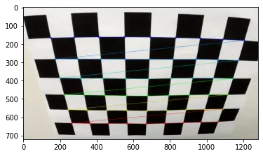
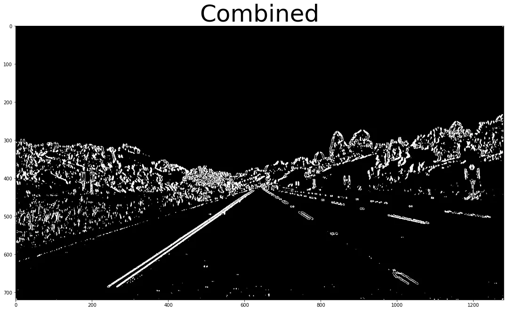

## Advanced Lane Finding

In this project, your goal is to write a software pipeline to identify the lane boundaries in a video, but the main output or product we want you to create is a detailed writeup of the project.

### The Project

The goals / steps of this project are the following:

1. Compute the camera calibration matrix and distortion coefficients given a set of chessboard images.
2. Apply a distortion correction to raw images.
3. Use color transforms, gradients, etc., to create a thresholded binary image.
4. Apply a perspective transform to rectify binary image ("birds-eye view").
5. Detect lane pixels and fit to find the lane boundary.
6. Determine the curvature of the lane and vehicle position with respect to center.
7. Warp the detected lane boundaries back onto the original image.
8. Output visual display of the lane boundaries and numerical estimation of lane curvature and vehicle position.

#### 1,2 Camera Calibration

In just project we will use [Pinhole](https://en.wikipedia.org/wiki/Pinhole_camera_model) model camera. Which will be calibrated using checkerboard `(9x6)`.
The calibration images will be provided inside `camera_cal/*.jpg`.

We will use `findChessboardCorners` from `OpenCV`. which will get internal corners.

The order of chekerboard corners in camera plane is welldefined. After getting 2d corner and predefined corner in camera plane we can use 
`calibrateCamera` from `OpenCV` too. Which will estimate camera matrix and camera distorition paramters.

Now can undistor the input camera, I select this two images because the ridal distortion is so clear in left side at `undistort5` and in both sides of `undistort1`.

From now all input camera will be undistored by default.

#### 3. Binary theshold

We need to isolate the lanes from the remaining of the image.
We will use binary thresolding which mean that anything pass the threshold we be setted to one
We need a combination of thresholding opertion to isolate the lane lines.

1. SobelX and SobelY
2. Edge direction and magniture.
3. using Saturation channel from `HLS` color space.

#### 4. Birds-eye view
