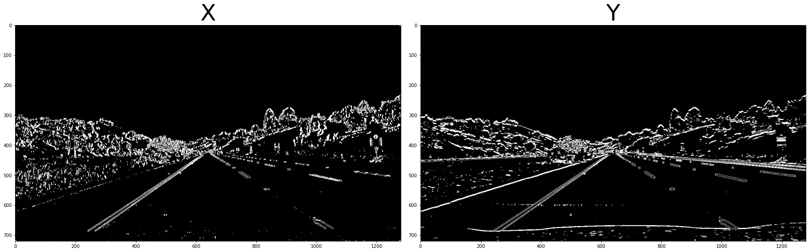
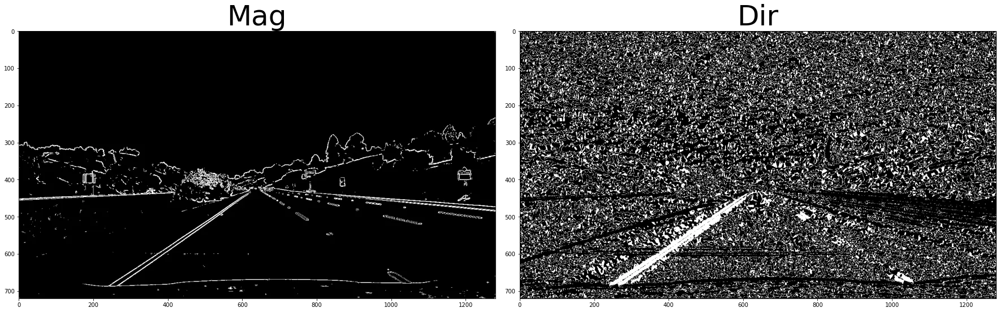
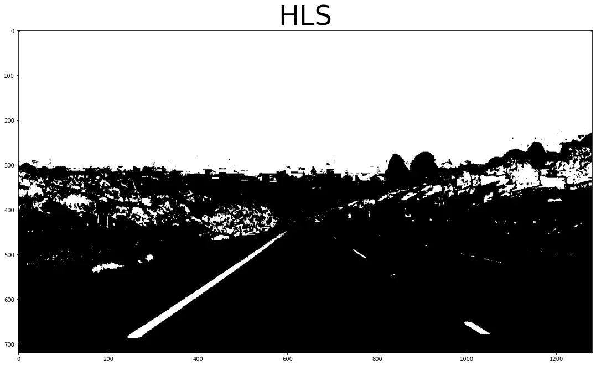
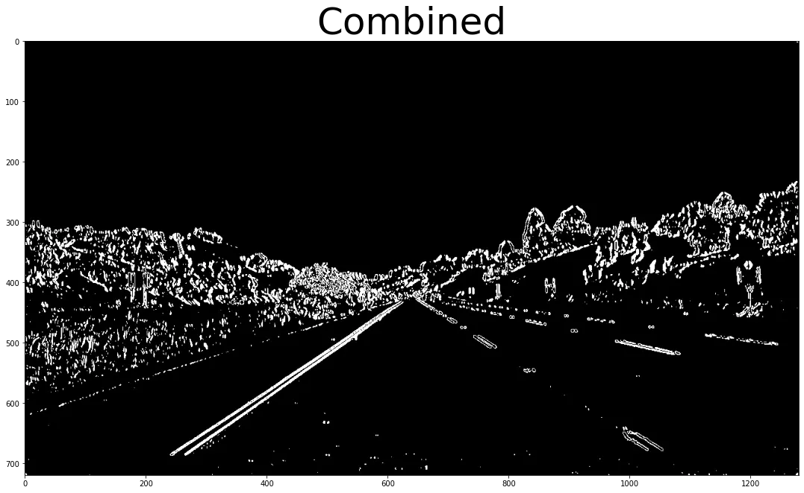

#### 3. Binary theshold

We need to isolate the lanes from the remaining of the image.
We will use binary thresolding which mean that anything pass the threshold we be setted to one
We need a combination of thresholding opertion to isolate the lane lines.

1. SobelX and SobelY
2. Edge direction and magniture.
3. using Saturation channel from `HLS` color space.

