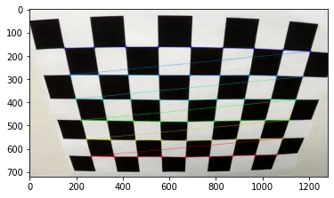
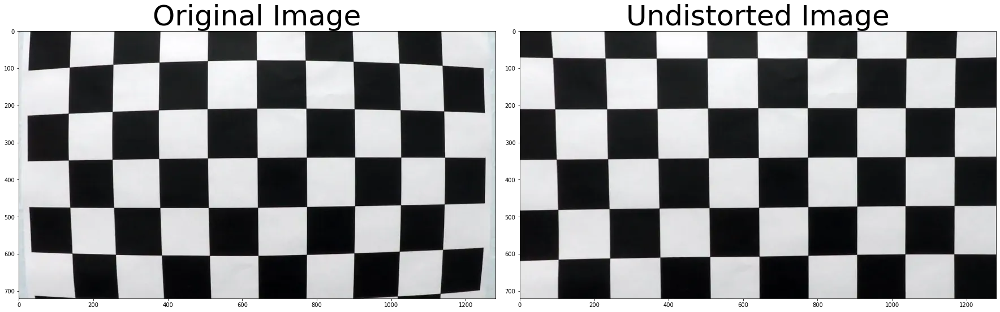
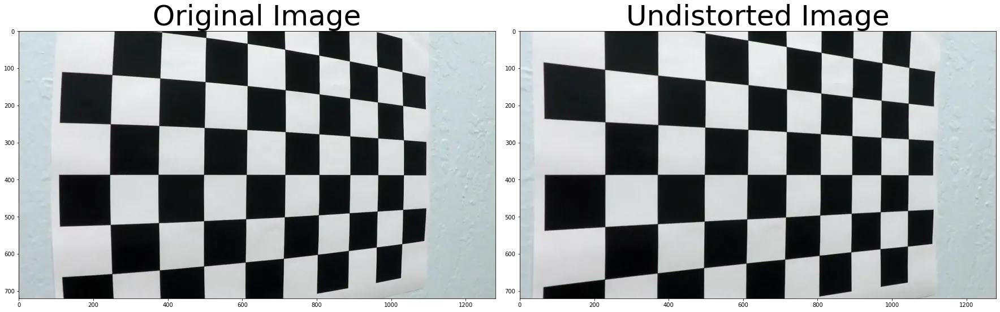

#### 1,2 Camera Calibration

In just project we will use [Pinhole](https://en.wikipedia.org/wiki/Pinhole_camera_model) model camera. Which will be calibrated using checkerboard `(9x6)`.
The calibration images will be provided inside `camera_cal/*.jpg`.

We will use `findChessboardCorners` from `OpenCV`. which will get internal corners.

The order of chekerboard corners in camera plane is welldefined. After getting 2d corner and predefined corner in camera plane we can use 
`calibrateCamera` from `OpenCV` too. Which will estimate camera matrix and camera distorition paramters.

Now can undistor the input camera, I select this two images because the ridal distortion is so clear in left side at `undistort5` and in both sides of `undistort1`.

From now all input camera will be undistored by default.

